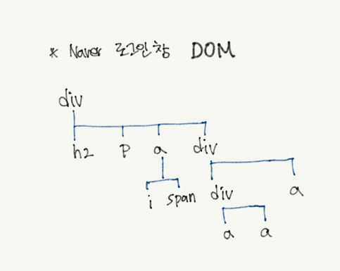

# 1. C-S 구조

> client-server 구조

> 컴퓨터와 컴퓨터가 통신하는 구조
>
> 클라이언트가 요청하면 서버가 응답하는 방식으로 작동

## 1-1. 클라이언트(client)

- browser (Chrome, Microsoft Edge, game, Iot, smartphone 등)
- 인터넷이 가능한 모든 환경
- 서비스를 요청(request)하는 시스템

## 1-2. 서버(server)

- 서비스를 제공,응답(response)하는 시스템
- 개발
- API
- 처리

> ### 1-2-1. 서버(server)의 처리

> 1. Front End
>    - 클라이언트가 볼 수 있는 화면
>    - HTML(Hyper Text Makeup Language), CSS
>    - Java Script
> 2. Back End
>    - data 처리
>    - python, JS, Java

# 2. 속성(Attribute)

> Tag -> 객체(Object) -> 요소(Element)

## 2-1. 속성 부여 방법

```
<태그명 속성명 = "속성값" 속성명="속성값> </태그명>
# element : 실제 사용 가능한 것
```

### 2-1-1. 예

```
<a href="https://www.naver.com" target="_blank">네이버로 이동</a>
# 앵커 element를 만들었다.
# href속성
```

# 3. DOM(Document Object Model)

> Java Script 용어
>
> 문서 내 객체 구조
>
> Elemnet & Element 사이의 관계

## 3-1. Documemt

## 3-2. DOM 구조 연습

> - 최상위 element
> - 자식 element
> - 자손 element
> - 형제 element



### 3-2-1. DOM 특징

- 자식은 자손에 포함 가능

- 자식은 자손을 포함하지 않음
